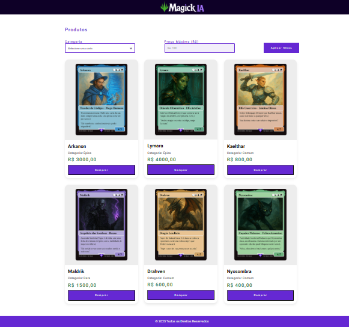
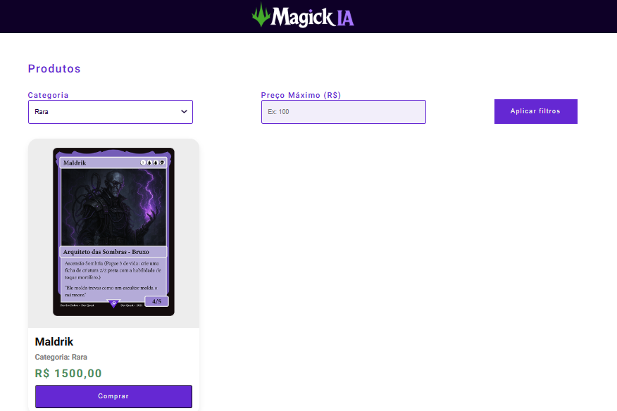

## 📌 Informações gerais

Este projeto  foi desenvolvido em conjunto na semana do zero ao programador com o DevEmdobro. 
É uma página de e-commerce para venda de cartas inspirada no jogo Magic: The Gathering Arena.

## 🛠 Tecnologias Utilizadas
 

  
  
  

## 🚀 Funcionalidades
- **Exibição da Lista de Cartas**: Mostra as cartas disponíveis e seus respectivos valores.
- **Estilização Responsiva**: Interface adaptável para diferentes dispositivos.

## 📌 Exemplo de Uso
1. A página inicial exibe uma lista de Cartas.
2. Você pode filtrar as cartas dependendo da sua categoria (comum, rara ou épica) e preço.
3. Ao encontrar a carta desejada, é só clicar em comprar.

## Imagens

## 🔗 Link de Acesso
### https://github.com/carolinavitorio/Magick-IA.git
---

